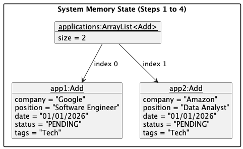
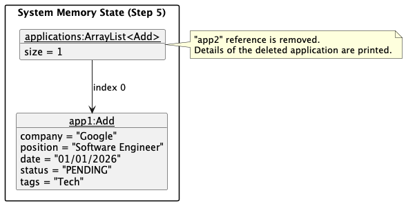

# Developer Guide

## Acknowledgements

{list here sources of all reused/adapted ideas, code, documentation, and third-party libraries -- include links to the original source as well}

## Design & Implementation

{Describe the design and implementation of the product. Use UML diagrams and short code snippets where applicable.}

### Edit Application Feature
The Edit feature allows users to modify existing job applications. This feature was implemented by Labelle.

**Command Format**: edit INDEX [c/COMPANY] [p/POSITION] [d/DATE] [s/STATUS]

All fields after the index are optional. Only specified fields are updated.

Example Usage:
edit 1 c/Microsoft  (Update company only)
edit 2 p/Senior Engineer d/2024-12-01  (Update position and date)
edit 3 s/Interview  (Update status only)

**Implementation Details**

The Edit application feature is implemented through a Edit class:
1.	Extract index from command
2.	Validate index (1 ≤ index ≤ list size)
3.	Retrieve target Add object
4.	Parse remaining command for c/, p/, d/, s/ prefixes
5.	For each field: call corresponding setter on target
6.	Validate date format before setting
7.	Display updated application

**Sequence Diagram** (command: edit 1 c/Google p/SWE d/2024-09-12):

| Component | Method Call | Data Flow |
|------|-------------|-----------|
| User | `edit 1 c/Google p/SWE d/2024-09-12` | → JobPilot |
| JobPilot | `editApplication(input, applications)` | → Edit |
| Edit | `parseIndex()` | index = 0 |
| Edit | `applications.get(0)` | ← target application |
| Edit | `parseFields()` | c/, p/, d/ detected |
| Edit | `setCompany("Google")` | → Add |
| Edit | `setPosition("SWE")` | → Add |
| Edit | `validateDate("2024-09-12")` | valid |
| Edit | `setDate("2024-09-12")` | → Add |
| Edit | return success | → JobPilot |
| JobPilot | display result | → User |

**Error Handling**

| Error Scenario | Condition | User Response |
|----------------|-----------|---------------|
| Missing Index | User enters `edit` without a number | "Please provide an index. Example: edit 1 c/Google" |
| Invalid Index | Index is 0, negative, or exceeds list size | "Invalid application number! You have X application(s)." |
| No Fields | User provides index but no fields to update | "No valid fields to update! Use: c/, p/, d/, s/" |
| Invalid Date Format | Date not in `YYYY-MM-DD` format | "Invalid date! Use YYYY-MM-DD (e.g., 2024-09-12)" |

**Design Rationale**

| Decision                             | Rationale                                                        |
|--------------------------------------|------------------------------------------------------------------|
| Separate Edit class                  | Maintains single responsibility and easier to test independently |
| Optional fields                      | Allows partial updates                                           |
| Prefix-based parsing (`c/`, `p/`, `d/`, `s/`) | Consistent with `add` command and easier for users to remember   |
| Date validation                      | Prevents invalid data from entering the system                   |

### Delete Application Feature

#### Implementation Details

The Delete application mechanism is facilitated by the main `JobPilot` class and delegated to a dedicated `Delete` utility class. The application's core state is managed within a single `ArrayList<Add>` named `applications`, which stores all job application entities.

The operations are exposed and handled internally via the following methods:

* `JobPilot#deleteApplication(String, ArrayList<Add>)` — Acts as an intermediate router that intercepts the raw user input and delegates it to the `Delete` class.
* `Delete#deleteApplication(String, ArrayList<Add>)` — Parses the string to extract the target index, validates the bounds against the `ArrayList`, removes the `Add` object, and handles the console output.

Given below is an example usage scenario demonstrating how the Delete mechanism behaves at each step.

**Step 1.** The user executes `delete 2`. The `Scanner` inside the `JobPilot.main()` loop reads the raw input string.

**Step 2.** The `if-else` execution block in `JobPilot.main()` recognizes the `delete` command and routes execution to the private helper method `JobPilot#deleteApplication()`.

**Step 3.** The helper method immediately delegates the operation to the static `Delete.deleteApplication()` method. The `Delete` class splits the raw string by spaces (`input.split(" ")`) to extract the index `"2"`.

**Step 4.** `Delete.deleteApplication()` parses the extracted string into an integer and converts it to a 0-based index (`1`). It validates that the index is within the valid bounds of the `applications` list.

**Step 5.** The target `Add` object is removed via `applications.remove(1)`. Instead of returning control to a UI component, the `Delete` class directly prints the details of the removed object and the remaining application count to `System.out`.

*Note: If the user inputs a non-numeric index (e.g., `delete abc`), a `NumberFormatException` is caught internally by the `Delete` class, which then throws a custom `JobPilotException` back up to the main loop to be displayed.*

The following sequence diagram shows the flow of deleting an application:

#### Design Considerations

**Aspect: Command delegation:**

* **Current Implementation:** The static `Delete` class handles both the domain logic (removing the `Add` object from the `ArrayList`) and the UI logic (printing the success message via `System.out`).
    * *Pros:* Splits the workload of `JobPilot` by extracting the specific deletion into its own class.
    * *Cons:* Increased coupling. 
* **Alternative:** Have `Delete.deleteApplication` return the deleted `Add` object.
  * *Pros:* Separates concerns, making the deletion logic purely functional, highly cohesive, and significantly easier to test.
  * *Cons:* Requires refactoring the current architecture, which is difficult due to the given time constraints.

## Product scope
### Target user profile

{Describe the target user profile}

### Value proposition

{Describe the value proposition: what problem does it solve?}

## User Stories

|Version| As a ... | I want to ... | So that I can ...|
|--------|----------|---------------|------------------|
|v1.0|new user|see usage instructions|refer to them when I forget how to use the application|
|v2.0|user|find a to-do item by name|locate a to-do without having to go through the entire list|

## Non-Functional Requirements

{Give non-functional requirements}

## Glossary

* *glossary item* - Definition

## Instructions for manual testing

{Give instructions on how to do a manual product testing e.g., how to load sample data to be used for testing}

### Edit Feature Testing

| Test          | Command | Expected |
|---------------|---------|----------|
| Edit company  | `edit 1 c/Microsoft` | Company updated |
| Edit position | `edit 1 p/Senior Engineer` | Position updated |
| Edit date     | `edit 1 d/2024-12-01` | Date updated |
| Edit status   | `edit 1 s/Interview` | Status updated to Interview |
| Edit multiple | `edit 1 c/Google p/SWE d/2024-09-12` | All fields updated |
| Invalid index | `edit 99 c/Google` | Error: invalid index |
| No fields     | `edit 1` | Error: no fields to update |
| Invalid date  | `edit 1 d/2024-13-01` | Error: invalid date format |

