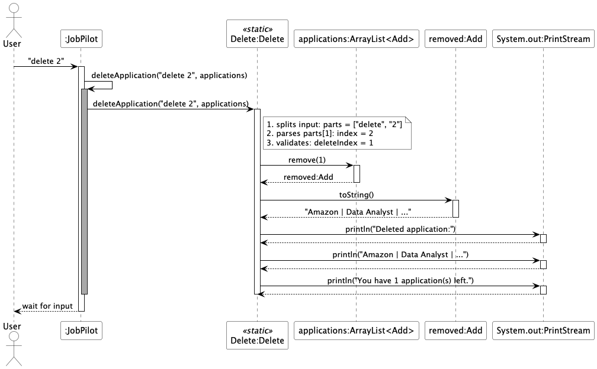

# Abigail Tong's Project Portfolio Page

## Overview

### Project: JobPilot
**JobPilot** is a command-line application designed to help computing students efficiently manage their job applications.

## Summary of Contributions

### Code Contributed:
*[Link to code on tP Code Dashboard.](https://nus-cs2113-ay2526-s2.github.io/tp-dashboard/?search=&sort=defaultSortOrder&sortWithin=title&timeframe=commit&mergegroup=&groupSelect=groupByRepos&breakdown=true&checkedFileTypes=docs~functional-code~test-code~other&since=2026-02-20T00%3A00%3A00&filteredFileName=&tabOpen=true&tabType=authorship&tabAuthor=abigailtong&tabRepo=AY2526S2-CS2113-W13-3%2Ftp%5Bmaster%5D&authorshipIsMergeGroup=false&authorshipFileTypes=docs~functional-code~test-code~other&authorshipIsBinaryFileTypeChecked=false&authorshipIsIgnoredFilesChecked=false])*

### New Features:
- **Deletion of Application (`Deleter.java`)**
  - Implemented the full deletion workflow for job applications with validation for invalid indices and empty lists.
  - `Deleter` to handle only deletion logic and return the deleted `Application` object to `CommandRunner`, keeping the architecture modular and separating business logic from UI handling.
  - The implementation was moderately challenging as it required coordination between various components.
  - The feature is complete as it supports valid deletion and safely handles invalid or edge-case inputs.

- **Persistent Storage (`Storage.java`)**
  - Implemented saving and loading of applications in `JobPilotData.txt` inside a `data/` directory.
  - Automatically creates missing storage directory and files if they do not exist.
  - Parses saved applications back into objects while actively skipping corrupted or incomplete lines instead of crashing the application.
  - This was a deeper enhancement because it required handling file I/O, parsing logic, error recovery, and data consistency across multiple fields.
  - The feature is complete as it supports both reading and writing of all application data and handles common failure cases such as missing files and corrupted entries.

### Enhancements Added:
- **UI Component (`Ui.java`)**
  - Designed the CLI interface for JobPilot with dedicated methods for displaying user-facing and error messages for all commands.
  
- **Storage Tests (`StorageTest.java`)**
  - Test scope included edge cases such as empty files, missing files, and corrupted lines to ensure the storage component behaves safely, with 83% Line Coverage.

- **Delete Feature Tests (`DeleterTest.java`)**
  - Test scope included the deleting applications at different positions in the list, with 71% Line Coverage.
 
- **Exceptions Class (`JobPilotException.java`)**
  - Standardized error handling by allowing different components to throw consistent exception messages.
 
### Developer Guide Contributions:
- Documented the UI component, storage component, and delete feature.
- Added PlantUML class and sequence diagrams for the above components and features.
- Wrote manual test cases for delete and storage features.
- Specified acknowledgements, non-functional requirements, target user profile, and value proposition.

### User Guide Contributions:
- Documented `help`, `delete`, and `bye` commands.
- Documented **command summary** for all features.
- Authored FAQ, quick start instructions, and introduction sections.

### Contributions to Team-Based Tasks
1. Kept track of internal team timelines and maintained the issue tracker, ensuring tasks and milestone deadlines were properly set.
2. Spearheaded separation of concerns by splitting the code into multiple functional classes.
3. Released v1.0 and v2.0, including all necessary items, and authored the project overview in `README.md`.
4. Defined target user profile, value proposition, and non-functional requirements in the Developer Guide.
5. Authored acknowledgements and manual testing instructions for launching JobPilot using `JobPilot.jar` and checking for the CLI prompt and logo in the Developer Guide.
6. Documented product introduction, directory setup, quick start instructions and command summary in the User Guide.

<div style="page-break-after: always;"></div>

## Contributions to the Developer Guide:

### UI Component:
The API of this component is specified in `Ui.java`.


### Delete Feature:
The following sequence diagram shows the flow of deleting an application:



<div style="page-break-after: always;"></div>

## Contributions to the User Guide:

### Introduction:
JobPilot is an application designed to help computing students manage their job applications efficiently. It works through a Command Line Interface (CLI), but still provides the convenience of a simple graphical interface.
By using JobPilot, users can track application progress and important details without the hassle of manual lists or spreadsheets.

## Quick Start

1. **Install Java 17+:** Verify that your computer has Java `17` or a newer version installed. <br>
   *Mac users:* Please follow the specific JDK installation guide [here](https://se-education.org/guides/tutorials/javaInstallationMac.html).
2. **Download the App:** Grab the latest `.jar` release file from [here](https://github.com/AY2526S2-CS2113-W13-3/tp/releases).
3. **Set Up Your Directory:** Move the downloaded file into a dedicated new folder. (Note: Running the app for the first time will automatically generate a `data/JobPilotData.txt` file in this directory to save your tasks).
4. **Launch JobPilot** Open your terminal and run the app with the following command: `java -jar <release-name>.jar`


### Deleting an application: `delete`
Deletes the specified application from JobPilot.

Format: `delete INDEX`

- Deletes the application at the specified INDEX.
- The index refers to the index number shown in the displayed application list though the list command.
- The index must be a positive integer 1, 2, 3, ...

Examples:
- `delete 1`
- `list` followed by `delete 2`

Example output:
```text
Deleted application:
Google | SE manager | 2025-03-10 | INTERVIEW
You have 4 application(s) left.
___________________________________________________________________
```